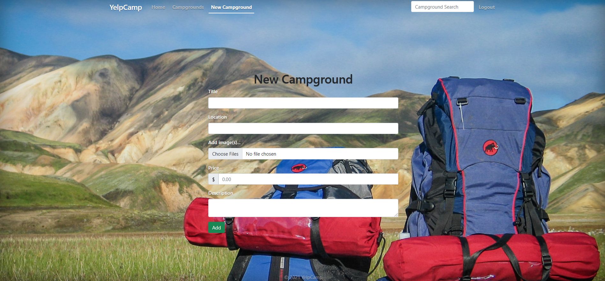

# YelpCamp
Hi!
YelpCamp is a website that I develop for pepole to share information about campgrounds across the globe.

## Screenshots

## Built With

* [Express](https://expressjs.com/) - Express.js, or simply Express, is a back end web application framework for Node.js
* [MongoDB](https://www.mongodb.com/) - MongoDB is a source-available cross-platform document-oriented database program
* JavaScript  - JavaScript is a scripting or programming language that allows you to implement complex features on web pages.
* HTML -  is the standard markup language for documents designed to be displayed in a web browser.
* CSS - CSS is a style sheet language used for describing the presentation of a document written in a markup language such as HTML.
* [Bootstrap](https://getbootstrap.com/) - Bootstrap is a free and open-source CSS framework directed at responsive, mobile-first front-end web development. It contains CSS- and JavaScript-based design templates for typography, forms, buttons, navigation, and other interface components
